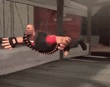
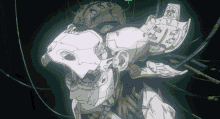
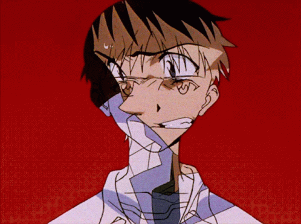
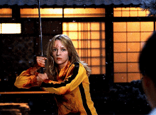

<!DOCTYPE html>
<html lang="en">
<head>
    <meta charset="UTF-8">
    <meta name="viewport" content="width=device-width, initial-scale=1.0">
    <title>My space de mimi</title>
    <link rel ="icon" type="image/jpeg"
    href="images.jpeg">
</head>
<body>
    

    <header class="main-grid">
        

            
this is me btw :3 if u even care..

            
        

        

            <h1>MIGUEL / MIMI</h1>
            
Ele / Dele

            
🎂  15 out XII . ' ! !

            
pt , eng

            

                
                
                
            

        

    </header>

    <section class="fandoms">
        <h2>✧ fandoms ________</h2>
        
gits, tf2, furry, heteros anonimos, silent hill...

    </section>

    

        

            <h3> FW</h3>..</h3>
            <ul>
                <li>AMIGOS</li>
                <li>FURRYS</li>
                <li>JOGOS</li>
                <li>COMPUTAÇÃO</li>
            </ul>
        

        

            
DNI ...

            <ul>
                <li>Gays</li>
                <li>Negros</li>
                <li>Jogadores de free fire
                    <li> Fumantes</li>
                </li>
            </ul>
        

    

    

         kins : viciados em jogar, computadores, rafael, biel meu bestie ><
    

    <footer>
        btw i love twin, my friends ^^
    </footer>

</body>
</html>
